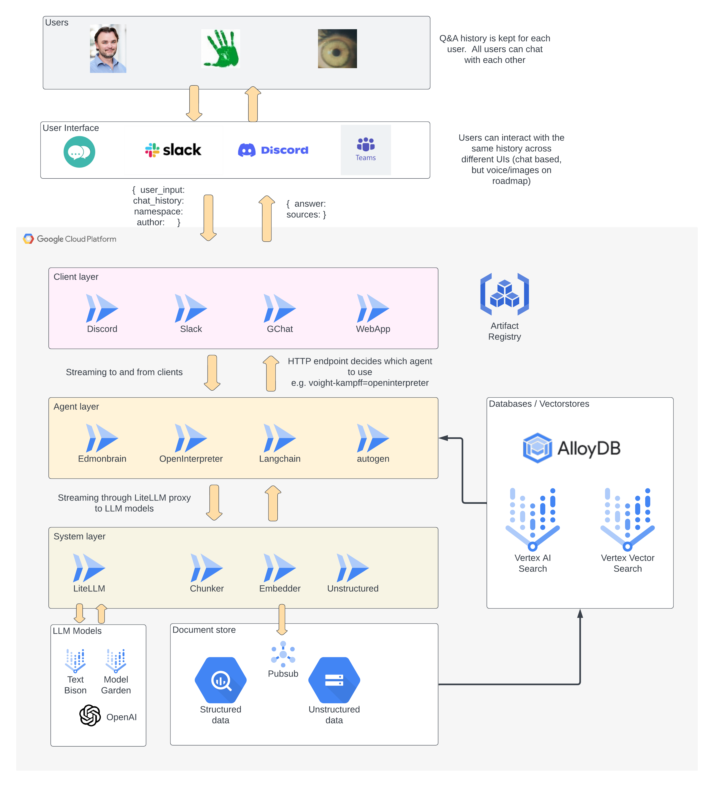

# Sunholo Multivac

Welcome to the web client for Sunholo Multivac.

## What is Multivac?

Sunholo Multivac is a GenAI platform, that provides solutions tailored to enhance your GenAI use cases. As you explore the potential of language, vision and other types of GenAI models, Multivac's aim is to help as a versatile and ready-to-use tool to support your journey from concept to production.

This web chat interface is one of the supported Multivac Clients.  If you prefer you can also interact via Discord, Slack, Google Chat, or programmatically via the APIs.

Each Multivac Client connects to the various Multivac agents called Vacs that lie within the Agent layer.  These Vacs carry various GenAI and LLM applications, that then hook into the supported Service layer, including vector databases, chat history, analytics and document stores.

## Cloud Architecture

## Multivac Capabilities

Multivac sets itself apart with a configurable GenAI environment that seamlessly scales from minimal to high demand using serverless technology.

Multivac is hosted on the Google Cloud Platform, which includes Google Gemini Ultra, the most advanced GenAI model to date. This ensures your data remains within your private VPC, harnessing top-tier LLM capabilities without compromise.

The platform is enterprise-ready, offering multi-user authentication, database integrations, monitoring, and archiving. Integration with existing business processes is streamlined, supporting interfaces like a dedicated web portal, Slack, Discord, Google Chat, or Teams. All services are accessible through an API, allowing for custom solution integrations.

A notable application of Multivac is the "company brain" concept, facilitating access to dispersed organizational knowledge through chat history, document processing, and infinite recall capabilities, all available via common chat interfaces.

### Robust Security and Compliance

Multivac prioritizes security with a dedicated Virtual Private Cloud (VPC) and adheres to Google Cloud Platform's IAM best practices, ensuring stringent authentication and data protection.

### Unmatched Customization Flexibility

Multivac's architecture supports extensive customization. While applications can be containerized using Docker, static technologies like databases are configurable at build time. The platform focuses on GenAI needs, such as vector databases and embedding pipelines, with Google Cloud Platform offering various options to balance ambition, cost-effectiveness, and scalability. This makes Multivac ideal for firms seeking to experiment without substantial upfront cloud costs.

### Pricing Structure

Multivac provides a flexible pricing model. Options include a monthly subscription for our SaaS interface or a one-time deployment fee on your Google Cloud Platform with an ongoing license for updates. An open-source library is also available, ensuring a cost-effective solution that aligns with your financial needs.

### Broad Integration Capabilities 

Thanks to its container and microservices foundation, Multivac offers extensive integration possibilities via internal APIs. It supports data inputs from Google Cloud Platform services like BigQuery, integrating seamlessly with existing BigQuery pipelines, including cross-cloud setups. Multivac handles a wide range of data types, from structured sources to unstructured formats like PDFs, Word documents, emails, PowerPoint presentations, videos, and images. While focused on GCP, Multivac can easily connect to other popular GenAI platforms like OpenAI through a simple configuration change. Google's Vertex AI platform also offers access to open-source model alternatives and custom model training infrastructure.

### Innovative Future Roadmap 

Multivac is constantly evolving, with plans to introduce self-healing and self-improvement through custom GenAI agents (Vacs), as well as an expanding suite of pre-created agent modules such as RAG, document summarization, code reviews, and data analysis. These developments aim to keep Multivac at the technological forefront.

Multivac is more than a platform; it's a visionary solution poised to revolutionize how firms harness language models for sustained growth and breakthrough innovation.

## Try it out

But don't just rely on what you read - try it out below.  A simple RAG chat bot has been implemented with both the information above and more details for you to explore.  

